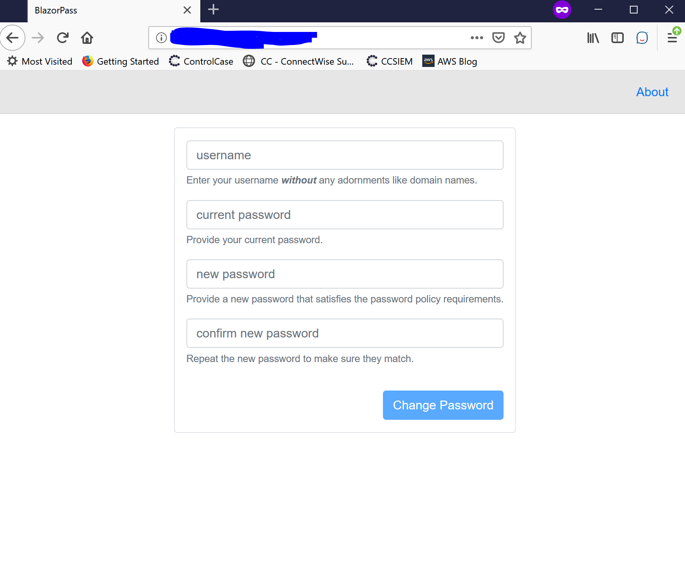

# BlazorPass
Blazor-based client for AD password management service

---

Provides a Blazor-based front-end and a ASP.NET Core back-end
that talks LDAP to a set of AD domain controllers to allow
self-service password management.

---

